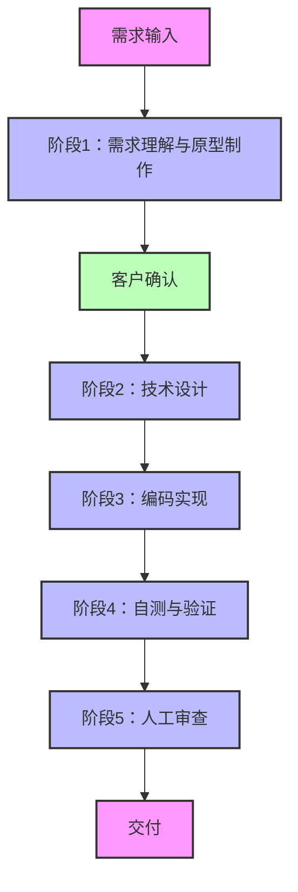

# AI编程规范模板介绍

## 设计理念

AI编程规范模板的核心理念是**工具无关性**和**高度可扩展性**，具体体现在以下几个方面：

- **工具无关**：不与特定AI工具绑定，支持Claude Code、Cursor、Trae IDE等多种AI工具，确保跨平台兼容性
- **标准识别**：采用标准化的目录结构和文件格式，确保不同AI工具能够正确识别和使用
- **高度复用**：模块化的技能和代理设计，支持在不同项目中重复使用
- **易于使用**：简洁明了的配置方式，新手开发者也能快速上手
- **易于改造**：灵活的架构设计，支持根据项目需求进行定制和扩展

## 工作流理念



## 1. 项目概述

AI编程规范模板是一个专为AI编程设计的规范驱动开发工具，结合OpenSpec和Superpowers方法论，通过轻量级的配置和标准化目录结构，让规范驱动流程可快速落地。

### 1.1 核心优势

- **支持主流AI工具**：兼容Claude Code、Cursor、Trae IDE等主流AI工具
- **无需复杂配置**：新手开发者也能快速上手
- **完整开发闭环**：涵盖"环境准备-流程执行-归档沉淀"三大阶段
- **可复用技能**：支持动态加载和组合技能
- **专业代理协作**：多角色代理配置，实现专业分工
- **自动化流程**：通过钩子配置实现开发流程自动化

## 2. 目录结构

```
.
├── .ai-config/            # AI编程配置目录
│   ├── agents/            # 【执行层】专业角色代理配置
│   │   ├── architect.md           # 架构师：负责系统架构设计和技术选型
│   │   ├── backend_dev.md         # 后端开发：负责后端API实现和维护
│   │   ├── dba.md                 # 数据库DBA：负责数据库设计、优化和管理
│   │   ├── frontend_dev.md        # 前端开发：负责前端应用开发和优化
│   │   ├── prototype_designer.md  # 原型设计师：负责UI/UX设计和原型制作
│   │   └── qa_engineer.md         # QA工程师：负责测试计划制定和执行
│   ├── mcp/               # 【连接层】外部工具与协议配置
│   │   ├── tools/         # 工具配置
│   │   │   └── db_schema.json     # 数据库模式配置
│   │   └── settings.json  # 系统设置：技能和代理加载配置
│   ├── rules/             # 【宪法层】不可逾越的开发规范
│   │   ├── 00_system_role.mdc     # 全局人设：定义 AI 是资深架构师，而非初级码农
│   │   ├── 01_tech_stack.mdc      # 技术边界：指定框架版本、禁止使用的库、CSS方案
│   │   ├── 02_code_style.mdc      # 代码美学：命名规范、目录结构、注释标准
│   │   ├── 03_security.mdc        # 安全红线：SQL注入防护、鉴权逻辑、环境变量处理
│   │   ├── 04_git_workflow.mdc    # 提交规范：Commit Message 格式、分支管理策略
│   │   └── 05_workflow.mdc        # 开发流程：标准化开发步骤和确认机制
│   ├── skills/            # 【能力层】可复用的技能库
│   │   ├── code-review/           # 代码审查：自动审查代码质量、安全性和性能
│   │   │   ├── SKILL.md           # 技能定义：描述、输入格式和输出格式
│   │   │   └── checklists.md      # 审查清单：详细的代码审查要点
│   │   ├── database-dba/          # 数据库DBA：提供数据库设计、SQL优化和性能调优
│   │   │   └── SKILL.md           # 技能定义：描述、输入格式和输出格式
│   │   ├── generate-prototype/    # 原型生成：快速生成前端原型，验证设计方案
│   │   │   └── SKILL.md           # 技能定义：描述、输入格式和输出格式
│   │   ├── scripts/               # 技能脚本：通用工具函数
│   │   │   └── file_utils.js      # 文件工具函数：文件读写和处理
│   │   └── write-plan/            # 计划编写：生成详细的开发计划，指导开发过程
│   │       ├── SKILL.md           # 技能定义：描述、输入格式和输出格式
│   │       └── implementation.js  # 技能实现：计划生成的具体逻辑
│   ├── hooks.json         # 【自动化层】生命周期钩子：定义事件触发的自动化行为
│   └── README.md          # 配置说明：.ai-config目录的使用指南
├── AI编程模板介绍.md       # 模板详细介绍：完整的模板功能和使用说明
├── EXAMPLE.md             # 使用示例：详细的开发流程示例
└── README.md              # 项目说明：项目概述和快速开始指南
```

### 2.1 关键目录说明

- **rules/**：【宪法层】不可逾越的开发规范，包含系统角色定义、技术栈选择、代码风格、安全规范、Git工作流和开发流程等
- **skills/**：【能力层】可复用的技能库，提供代码审查、原型生成、计划编写和数据库DBA等功能
- **agents/**：【执行层】专业角色代理配置，包含架构师、前端开发、后端开发、DBA、原型设计师和QA工程师等
- **mcp/**：【连接层】外部工具与协议配置，包含数据库模式和系统设置等
- **hooks.json**：【自动化层】生命周期钩子，定义文件保存、提交和PR创建等事件触发的自动化行为

## 3. 系统架构

AI编程规范模板采用分层架构设计，确保系统的可扩展性和灵活性：

### 3.1 架构层次

1. **宪法层**：由`rules/`目录下的规范文件构成，定义开发的基本原则和约束
2. **能力层**：由`skills/`目录下的技能构成，提供具体的开发能力
3. **执行层**：由`agents/`目录下的代理构成，负责执行具体的开发任务
4. **连接层**：由`mcp/`目录下的配置构成，连接外部工具和系统
5. **自动化层**：由`hooks.json`配置构成，实现开发流程的自动化
6. **索引层**：由目录结构和文件命名规范构成，确保系统的可发现性

## 4. 核心功能

### 4.1 规范驱动开发

- **系统角色定义**：明确AI的角色定位和行为准则
- **技术栈选择**：提供技术栈的选择标准和建议
- **代码风格规范**：统一代码风格，提高代码可读性
- **安全规范**：确保代码安全，防止安全漏洞
- **Git工作流**：规范版本控制流程
- **开发流程**：定义标准化的开发流程，确保开发质量

### 4.2 技能系统

- **代码审查**：自动审查代码质量、安全性和性能
- **原型生成**：快速生成前端原型，验证设计方案
- **计划编写**：生成详细的开发计划，指导开发过程
- **数据库DBA**：提供数据库设计、SQL优化和性能调优功能

### 4.3 代理系统

- **架构师**：负责系统架构设计和技术选型
- **前端开发**：负责前端应用的开发和优化
- **后端开发**：负责后端API的实现和维护
- **DBA**：负责数据库设计、优化和管理
- **原型设计师**：负责UI/UX设计和原型制作
- **QA工程师**：负责测试计划制定和执行

### 4.4 自动化流程

通过`hooks.json`配置，实现开发流程的自动化：

```json
{
  "on_file_save": [
    "trigger_skill:code_format",
    "trigger_skill:code_lint"
  ],
  "on_commit": [
    "trigger_skill:commit_lint",
    "trigger_skill:code_review"
  ],
  "on_pr_create": [
    "trigger_skill:pr_review",
    "trigger_skill:test"
  ]
}
```

## 5. 支持的AI工具

- **Claude Code**：通过扫描`.ai-config`目录识别模板
- **Cursor**：通过配置文件识别和使用模板
- **Trae IDE**：完全兼容，支持技能和代理的使用
- **VS Code**：通过插件支持，可与AI工具集成
- **其他AI工具**：支持标准的Markdown格式配置

### 5.1 工具使用指南

#### Claude Code
1. **目录结构**：确保`.ai-config`目录位于项目根目录
2. **文件格式**：所有配置文件使用标准的Markdown格式
3. **识别方式**：
   - Claude Code会自动扫描项目根目录下的`.ai-config`目录
   - 识别`rules/`目录下的规范文件
   - 识别`agents/`目录下的代理配置
   - 识别`skills/`目录下的技能定义
4. **使用方法**：
   - 在对话中明确指定使用此模板
   - 按照技能的输入格式提供指令
   - 例如：
     ```
     # 让 Claude Code 按照此模板的规范进行开发
     请参考 .ai-config 目录下的规范文件，按照以下步骤进行开发：
     
     1. 首先生成开发计划
     2. 然后生成前端原型
     3. 接着实现后端API
     4. 最后进行代码审查和测试
     
     技术栈：React + Node.js + PostgreSQL
     ```

#### Trae IDE
1. **目录结构**：确保`.ai-config`目录位于项目根目录
2. **文件格式**：所有配置文件使用标准的Markdown格式
3. **识别方式**：
   - Trae IDE会自动识别`.ai-config`目录
   - 支持通过工具面板直接使用技能
   - 支持通过指令触发代理
   - 提供可视化的技能和代理管理界面
4. **使用方法**：
   - 打开包含此模板的项目
   - 通过工具面板选择并使用技能
   - 或通过指令触发技能和代理
   - 例如：
     ```
     # 数据库DBA任务
     任务类型：数据库设计
     项目名称：用户管理系统
     技术栈：PostgreSQL
     
     ## 详细需求
     - 用户注册和登录功能
     - 用户列表管理（增删改查）
     - 用户详情查看
     - 用户信息编辑
     ```

#### VS Code
1. **目录结构**：确保`.ai-config`目录位于项目根目录
2. **文件格式**：所有配置文件使用标准的Markdown格式
3. **识别方式**：
   - 安装AI辅助开发插件（如GitHub Copilot、Codeium等）
   - 配置插件以识别`.ai-config`目录
   - 或通过自定义插件集成模板功能
4. **使用方法**：
   - 在VS Code中打开项目
   - 使用AI插件的命令面板触发技能
   - 或通过注释指令调用代理
   - 例如，在代码中添加注释：
     ```javascript
     // # 代码审查
     // 代码文件：frontend/src/components/Auth/Login.jsx
     // 审查重点：代码质量和安全性
     ```

## 6. 快速开始

1. **克隆此模板**到您的项目根目录
2. **配置环境**：根据项目需求修改`.ai-config`目录下的配置文件
3. **开始开发**：按照`EXAMPLE.md`中的示例使用技能进行开发

## 7. 使用示例

### 7.1 开发用户管理系统

#### 1. 环境准备
- 克隆模板
- 安装依赖
- 配置环境变量

#### 2. 生成开发计划
使用`write-plan`技能生成详细的开发计划

#### 3. 生成前端原型
使用`generate-prototype`技能生成前端原型

#### 4. 数据库设计与实现
使用`database-dba`技能设计和实现数据库

#### 5. 实现后端API
- 实现认证和用户管理API
- 启动后端服务

#### 6. 实现前端应用
- 构建前端组件
- 启动前端服务

#### 7. 代码审查
使用`code-review`技能审查代码

#### 8. 运行测试
- 运行前端测试
- 运行后端测试
- 生成测试覆盖率报告

#### 9. 部署上线
- 配置Docker
- 配置Docker Compose
- 执行部署命令

## 8. 扩展能力

### 8.1 添加新技能

1. **在`skills/`目录下创建新的技能文件夹**，例如`deploy/`
2. **编写`SKILL.md`文件**，定义技能的描述、输入格式和输出格式
3. **编写`implementation.js`文件**，实现技能的具体逻辑
4. **在`hooks.json`中配置触发时机**

### 8.2 配置新代理

1. **在`agents/`目录下创建新的代理配置文件**，例如`devops.md`
2. **定义代理的角色定位和核心职责**
3. **在需要时触发代理**

### 8.3 自定义规则

修改`rules/`目录下的规范文件，根据项目需求定制开发规范。

### 8.4 集成外部工具

在`mcp/`目录下配置外部工具，扩展系统的功能。

## 9. 最佳实践

1. **保持技能更新**：定期更新技能库，确保技能的有效性和先进性
2. **遵循规范**：严格按照`rules/`目录下的规范进行开发
3. **自动化流程**：利用`hooks.json`配置自动化触发行为
4. **持续改进**：根据项目需求不断优化和扩展技能
5. **文档化**：为每个技能和代理编写详细的文档
6. **测试驱动**：采用测试驱动开发方法，确保代码质量
7. **代码审查**：定期进行代码审查，发现和解决问题
8. **安全意识**：关注安全最佳实践，防止安全漏洞

## 10. 常见问题

### 10.1 技能不生效
- **问题**：技能触发后没有响应
- **解决方案**：
  1. 检查技能的触发格式是否正确
  2. 确保技能的实现文件存在且格式正确
  3. 检查`mcp/settings.json`中技能加载配置是否开启

### 10.2 代理无响应
- **问题**：触发代理后没有响应
- **解决方案**：
  1. 检查代理配置文件是否存在
  2. 确保代理的角色定位和职责定义清晰
  3. 检查`mcp/settings.json`中代理配置是否正确

### 10.3 钩子不触发
- **问题**：配置的钩子没有触发
- **解决方案**：
  1. 检查`hooks.json`中的配置是否正确
  2. 确保触发条件满足
  3. 检查相关技能是否存在

### 10.4 环境变量配置错误
- **问题**：服务启动失败，提示环境变量错误
- **解决方案**：
  1. 检查`.env`文件是否存在
  2. 确保所有必要的环境变量都已配置
  3. 检查环境变量的值是否正确

### 10.5 数据库连接失败
- **问题**：服务无法连接到数据库
- **解决方案**：
  1. 检查数据库服务是否运行
  2. 确保数据库连接字符串正确
  3. 检查数据库用户权限是否正确

## 11. 故障排除

### 11.1 服务启动失败
- **症状**：服务无法启动，显示错误信息
- **排查步骤**：
  1. 查看服务日志，了解具体错误信息
  2. 检查依赖是否正确安装
  3. 验证配置文件是否正确
  4. 检查端口是否被占用

### 11.2 API响应错误
- **症状**：API请求返回错误状态码
- **排查步骤**：
  1. 检查API路由是否正确配置
  2. 验证请求参数是否符合要求
  3. 查看后端日志，了解具体错误原因
  4. 检查数据库连接是否正常

### 11.3 前端页面无法加载
- **症状**：前端页面显示空白或错误信息
- **排查步骤**：
  1. 检查浏览器控制台，查看错误信息
  2. 验证前端资源是否正确加载
  3. 检查API请求是否成功
  4. 确认前端路由配置是否正确

## 12. 总结

AI编程规范模板是一个强大的工具，它通过标准化的目录结构、可复用的技能和专业的代理配置，为AI辅助开发提供了一套完整的解决方案。

### 12.1 主要价值

1. **规范开发流程**：遵循标准化的开发流程，确保代码质量和一致性
2. **提高开发效率**：利用预定义的技能和代理，减少重复工作
3. **确保代码质量**：通过代码审查和测试，提高代码质量和可靠性
4. **实现自动化**：通过钩子配置，实现开发流程的自动化
5. **支持团队协作**：为团队提供统一的开发规范和工具

### 12.2 适用场景

- **新项目初始化**：为新项目建立规范和流程
- **现有项目改造**：为现有项目引入规范和工具
- **团队协作**：统一团队的开发规范和工作流程
- **AI辅助开发**：与Claude Code、Cursor、Trae IDE等AI工具配合使用

AI编程规范模板设计为可扩展的，您可以根据项目需求添加新的技能和代理，定制开发流程，使其更好地满足您的具体需求。

## 13. 许可证

MIT License